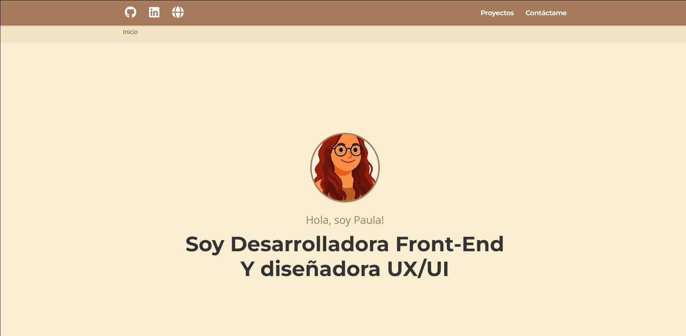

# Paula Miraz — Portfolio Personal

Portfolio web desarrollado desde cero para presentar mis proyectos y habilidades como Frontend Developer con enfoque en UX/UI.

🔗 **Demo en vivo:** https://my-portfolio-nu-ten-yycg9nytyl.vercel.app
📦 **Repositorio:** https://github.com/PaulaKDev/my-portfolio



## 🎯 Sobre el proyecto

Diseñé y desarrollé este portfolio como una single-page application con navegación por rutas, en lugar de usar un builder visual (como WordPress/Elementor), para tener control total sobre el código y demostrar mis habilidades reales de desarrollo frontend.

[Añade aquí 2-3 líneas propias: por ejemplo, por qué separaste los proyectos en tres páginas distintas (React / UX-UI / WordPress), o qué querías conseguir con la experiencia de usuario del sitio]

## 🛠️ Stack técnico

- **React 19** — librería principal de UI
- **Vite** — bundler y entorno de desarrollo (HMR rápido)
- **React Router DOM** — navegación entre páginas (Inicio, Proyectos React, Proyectos UX/UI, Proyectos WordPress)
- **Formik + Yup** — gestión y validación del formulario de contacto
- **Font Awesome** — iconografía
- **ESLint** — control de calidad de código

## ✨ Características

- Navegación por rutas independientes según el tipo de proyecto (React, UX/UI, WordPress)
- Formulario de contacto con validación de campos (Formik + Yup)
- Diseño responsive
- Componentes reutilizables (Card, ProjectCard, Breadcrumb, Header, Footer)
- Scroll automático al cambiar de página (`ScrollToTop`)

## 📂 Estructura del proyecto

```
src/
├── components/     # Componentes reutilizables (Header, Footer, Cards, etc.)
├── context/        # Context API para gestión de alertas/notificaciones
├── data/           # Datos de proyectos (projects.json)
├── hooks/          # Custom hooks (useSubmit para el formulario)
├── pages/          # Páginas por categoría de proyecto
└── images/         # Recursos visuales
```

## 🚀 Cómo correrlo en local

```bash
git clone https://github.com/PaulaKDev/my-portfolio.git
cd my-portfolio
npm install
npm run dev
```

## 🧠 Decisiones técnicas

[Esta es la sección que más valoran los reclutadores técnicos — elige 1-2 decisiones reales tuyas y explica el porqué. Algunas preguntas para ayudarte a rellenarla:
- ¿Por qué separaste los proyectos en tres páginas en vez de una sola con filtros?
- ¿Por qué Formik + Yup para el formulario en vez de manejar el estado a mano?
- ¿Usaste Context API (`alertContext`) para algo en concreto — notificar el envío del formulario, por ejemplo? ¿Por qué esa solución y no prop drilling?]

## 📬 Contacto

- LinkedIn: [paula-miraz-flores](https://linkedin.com/in/paula-miraz-flores)
- Email: paulamirazf@gmail.com
- Web: [paulak.es](https://paulak.es)